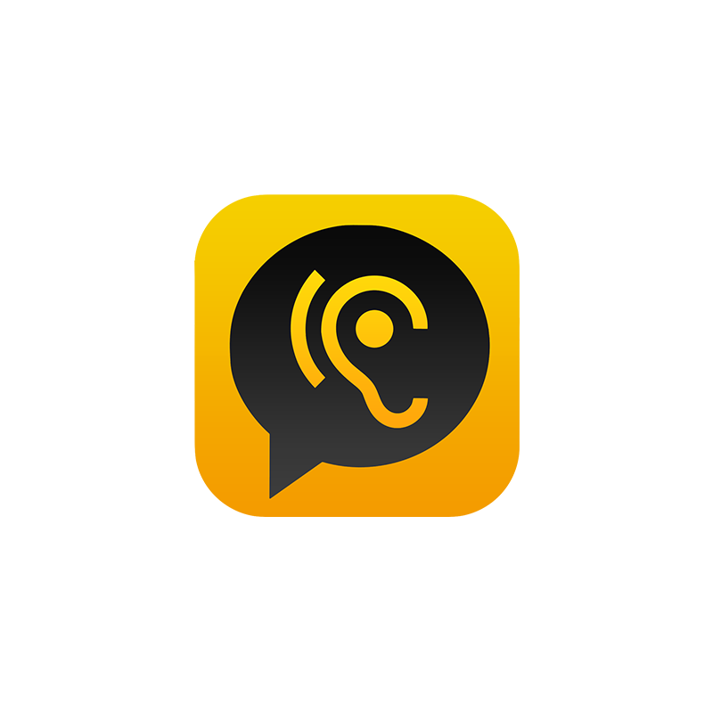
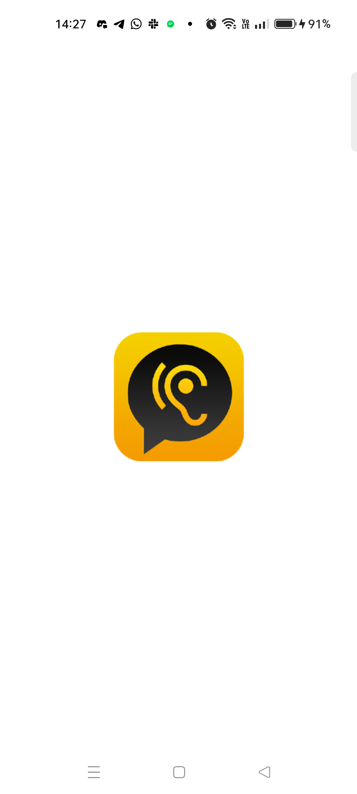
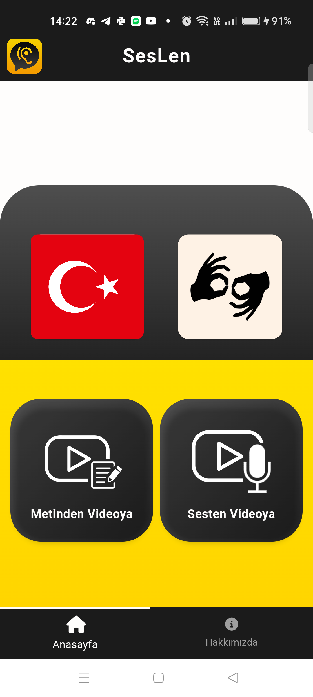
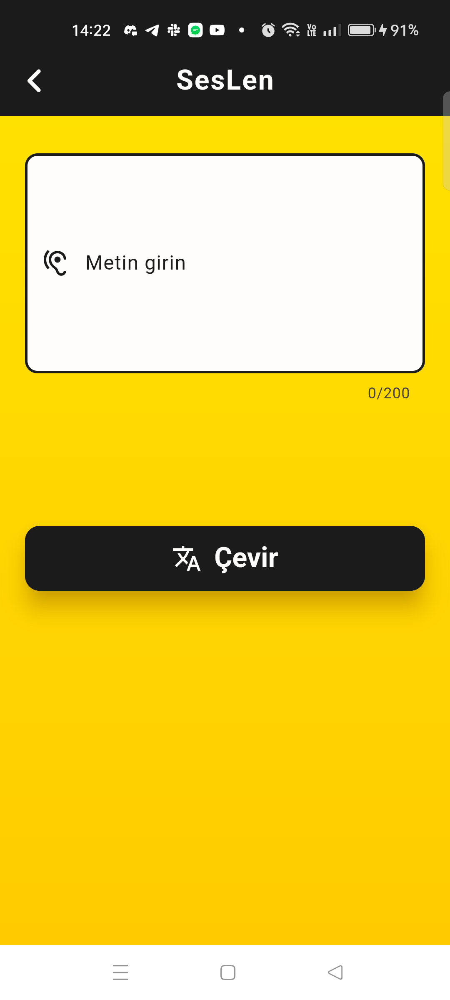
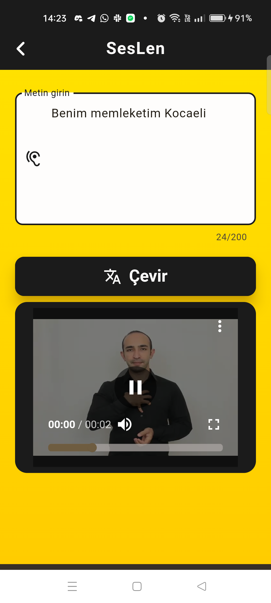
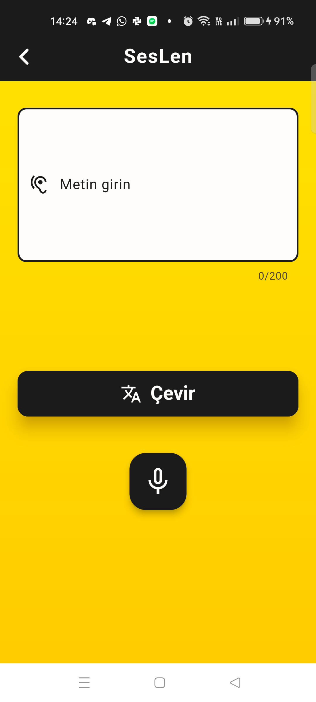
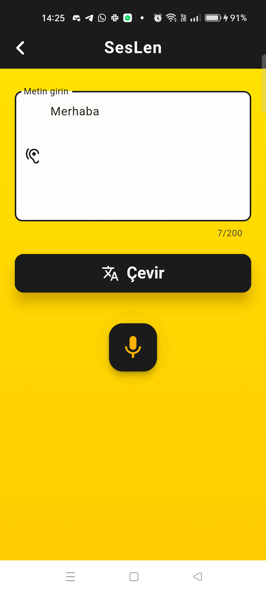
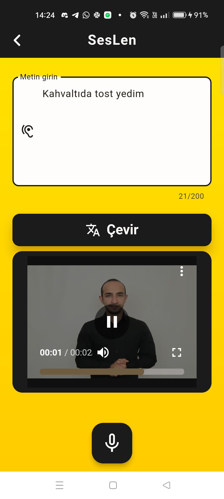
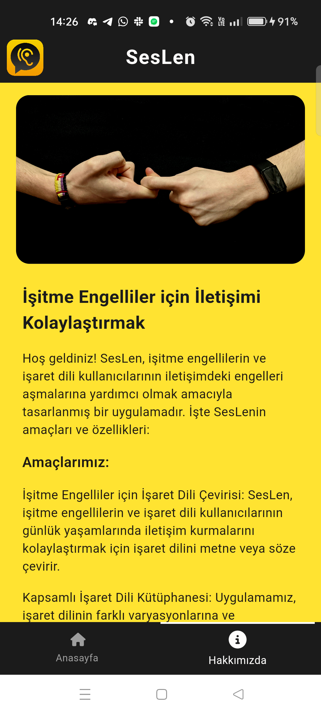

# SesLen
Bu uygulama, işitme engelli bireylerin sesli veya yazılı ifadeleri işaret dilinde video olarak görmelerini sağlayan bir mobil uygulamadır. Bu sayede, işitme engelli bireyler bulundukları ortamlarda konuşulanları anlayabilir ve sohbete katılabilirler.



## Ekip Üyeleri
- Hüseyin Karabulut
- Mustafa Fatih Yıldız
- Salih Dal
- Furkan Ülgen

## HEDEF KİTLE 
- İşitme Engelli Bireyler ve onlarla iletişim halinde olan diğer bireyler

## Özellikler
- Uygulama iki seçenek sunar: Sesten Videoya Çeviri ve Metinden Videoya Çeviri.
- Sesten Videoya Çeviri seçeneğinde, kullanıcı mikrofonu kullanarak sesli bir ifade kaydeder. Uygulama bu sesi işaret diline çevirir ve ekranda video olarak gösterir.
- Metinden Videoya Çeviri seçeneğinde, kullanıcı klavye ile yazılı bir ifade yazar. Uygulama bu metni işaret diline çevirir ve ekranda video olarak gösterir.
- Uygulama, Türk İşaret Dili’ni destekler.

## Ekran Görüntüleri

<table>
  <tr>
    <td>1</td>
     <td>2</td>
     <td>3</td>  
  <tr>
    <td></td>
    <td></td>
    <td></td>   
 </table>

<table>
  <tr>
    <td>4</td>
     <td>5</td>
     <td>6</td> 
  <tr>
    <td></td>
    <td></td>
    <td></td>
 </table>
  
<table>
  <tr>
    <td>7</td>
     <td>8</td>
  <tr>
    <td></td>
    <td></td>
 </table>


## Örnek Metinler
```
Benim memleketim Kocaeli
Eniştemle yarın ders çalışacağız
Kahvaltıda tost yedim
Bugün hava sıcak
Sinemaya gitmek istiyorum
```

Bu uygulamayı geliştirirken işitme engelli bireylere yardımcı olma amacımızı gerçekleştirmeye çalıştık. Eğer projemize katkıda bulunmak veya sorularınız varsa, lütfen bizimle iletişime geçin.
